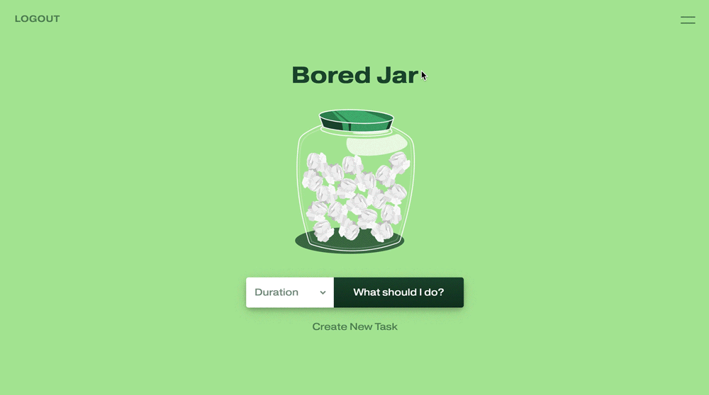

# Bored Jar
A mobile-first application that allows you to add activities and tasks into a 'Bored Jar' to pull from whenever you have extra time on your hands and need help deciding how to fill that time.

        




## User Story
```
As a person with extra time on my hands
I want a digital jar filled with activities or tasks
So that I can quickly pull from them when I'm bored
```


## Functionality
```
WHEN a user visits the web application
THEN they're promped to either sign up or log in

WHEN a user creates an account
THEN they have access to the data in their account any time they log in

WHEN a user logs in
THEN their personal 'jar' is displayed

WHEN a user has zero items in their jar
THEN an empty jar is displayed

WHEN a user has 1-24 items in their jar
THEN a crumpled up piece of paper is displayed inside the jar for each item

WHEN a user has 24+ items in their jar
THEN the jar displays as full

WHEN a user selects a duration and clicks the 'What Should I Do?' button
THEN a random item is selected from the database items with that duration

WHEN a user clicks the 'Create New Task' link or the burger icon
THEN a sidebar drawer slides in with all items in the database

WHEN a user adds an item, selects a duration, and submits the new item
THEN the item is added to the database and displayed in the list below

WHEN a user clicks the check mark next to an item
THEN the item get deleted from the database and the list below

WHEN a user clicks the 'Logout' link
THEN the user is logged out and redirected to the Sign Up form
```


## Table of Contents
* [Credits](#credits)
* [Questions](#questions)
* [Donate](#donate)
* [License](#license)


## Credits
A collaboration between [Lauren Siminski](https://github.com/siminski), [Kim Credit](https://github.com/kimcredit), [Teddy Lonczak](https://github.com/tedlon2314), and [Benedicta Kim](https://github.com/benedictakim). This web app wouldn't run without [Express](https://www.npmjs.com/package/express), [Express Handlebars](https://www.npmjs.com/package/express-handlebars), [MySQL2](https://www.npmjs.com/package/mysql2), [Passport](https://www.npmjs.com/package/passport), or [Sequelize](https://www.npmjs.com/package/sequelize).


## Questions
If you have any questions, feel free to find me at:
* Email: laurensiminski@gmail.com
* Website: https://siminski.co
* Github: [@siminski](https://github.com/siminski)


## Donate
Appreciate this code? Say thanks with a coffee:

[](https://ko-fi.com/W7W21YVJJ)


## License
Copyright (c) 2020 Lauren Siminski.